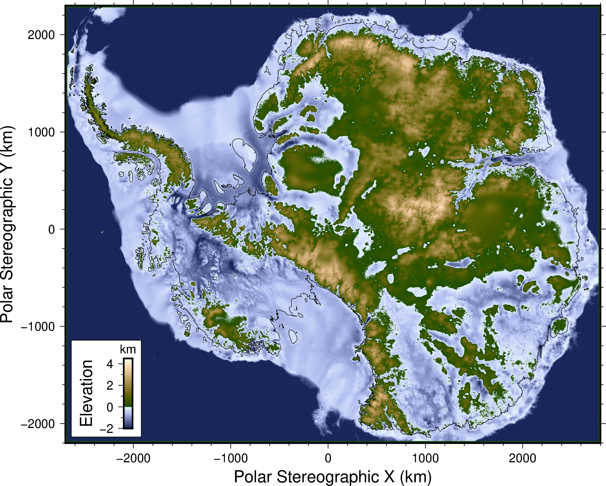

# CryoBedNet: Antarctic Bed Topography Super-Resolution

<p align="center">
  
</p>

**CryoBedNet** is a geospatial deep learning project for Antarctic bed-topography super-resolution. It modernizes the DeepBedMap idea into a clean PyTorch and HPC workflow with reproducible experiments, region holdout validation, baseline comparisons, visual diagnostics, and an interactive Streamlit dashboard.

The project links AI, cryosphere science, high-performance computing, and climate-risk visualization. It is designed as a research-grade portfolio project for showing technical depth across machine learning, geospatial modeling, scientific computing, and sustainability-focused analysis.

## Why this project matters

Antarctic bed elevation influences ice flow, grounding-zone behavior, subglacial drainage, and uncertainty in sea-level projections. Low-resolution continent-wide products are useful, but many regions need sharper bed-topography detail for downstream ice-sheet modeling.

CryoBedNet treats this as a multi-source super-resolution problem: combine a coarse bed-elevation prior with high-resolution auxiliary cryosphere layers and learn a sharper reconstruction of the underlying bed structure.

## What is included

- PyTorch super-resolution models: Residual U-Net and compact RRDB generator
- Optional PatchGAN discriminator for SRGAN-style training
- Region holdout experiments for glacier-level generalization
- Bicubic interpolation baseline
- Terrain-aware gradient loss and terrain metrics
- MLflow-compatible experiment logging
- DVC-style pipeline file for reproducible data and model stages
- SOL/Slurm GPU and CPU scripts
- Streamlit dashboard for prediction, residual, and transect visualization
- Technical report, attribution file, data-source guide, and resume bullets
- Mock data generator so the project runs immediately before real rasters are added

## Repository layout

```text
cryobednet-pro/
├── app/                         Streamlit dashboard
├── assets/images/                README and project figures
├── assets/reference/             DeepBedMap reference assets and license
├── configs/                      Experiment configs
├── docs/                         Technical notes, data sources, attribution
├── reports/                      Figures and generated experiment summaries
├── scripts/                      Data generation and workflow utilities
├── slurm/                        SOL/HPC batch scripts
├── src/cryobednet/               Python package
├── tests/                        Smoke tests
├── dvc.yaml                      Reproducible pipeline stages
├── environment.yml               Conda environment
├── pyproject.toml                Package definition
└── README.md
```

## Technical architecture

```text
Low-resolution bed prior
        │
        ├── Upsampled bed input
        │
High-resolution auxiliary layers
        │
        ├── Surface elevation
        ├── Velocity-like field
        ├── Accumulation-like field
        └── Ice mask / terrain context
        │
        ▼
PyTorch super-resolution model
        │
        ├── Residual U-Net
        └── RRDB-style generator
        │
        ▼
High-resolution bed prediction
        │
        ├── Region holdout evaluation
        ├── Bicubic baseline comparison
        ├── Terrain-gradient metrics
        └── Streamlit visualization dashboard
```

## Quick local run

Create and activate a virtual environment:

```bash
python -m venv .venv
source .venv/bin/activate
python -m pip install --upgrade pip
pip install -e .
```

On Windows PowerShell:

```powershell
python -m venv .venv
Set-ExecutionPolicy -Scope Process -ExecutionPolicy Bypass
.\.venv\Scripts\Activate.ps1
python -m pip install --upgrade pip
pip install -e ".[dash,dev]"
```

Create mock cryosphere tiles:

```bash
python scripts/make_mock_data.py --out data/mock_tiles.npz --n 800 --seed 42
```

Train a region-holdout model:

```bash
python -m cryobednet.train --config configs/local_polished.yaml
```

Evaluate against bicubic interpolation:

```bash
python -m cryobednet.evaluate --config configs/local_polished.yaml --split holdout
```

Create dashboard-ready figures:

```bash
python scripts/export_figures.py --run outputs/local_polished --split holdout
```

Open the dashboard:

```bash
streamlit run app/streamlit_app.py
```

Use this file in the app:

```text
outputs/local_polished/predictions_holdout.npz
```

## SOL workflow

```bash
cd ~/cryobednet-pro
conda env create -f environment.yml
conda activate cryobednet
pip install -e .
python scripts/make_mock_data.py --out data/mock_tiles.npz --n 2000 --seed 42
sbatch slurm/train_gpu.sbatch
squeue -u $USER
```

After the training job finishes:

```bash
sbatch slurm/evaluate_cpu.sbatch
```

Check logs:

```bash
ls logs
tail -f logs/cryobednet-train-<JOBID>.out
```

## Real-data upgrade path

The mock dataset uses the same tensor structure as the real project:

```text
x_lr      low-resolution bed input, shape [N, 1, H, W]
a_hr      high-resolution auxiliary channels, shape [N, C, H*scale, W*scale]
y_hr      high-resolution target bed elevation, shape [N, 1, H*scale, W*scale]
region    region labels used for holdout testing
```

Recommended real layers:

- BEDMAP2 or BedMachine Antarctica bed elevation as low-resolution bed prior
- REMA surface elevation
- MEaSUREs ice velocity magnitude
- snow accumulation / surface mass balance
- grounded/floating/ice mask
- airborne radar bed-elevation transects or gridded local high-resolution products as targets

## Region holdout experiment

A random split can overestimate performance because nearby raster tiles are spatially correlated. CryoBedNet supports region holdout, where one glacier basin is excluded from training and used only for testing.

Example:

```yaml
split:
  holdout_region: pine_island
```

The output includes:

- train/validation loss curves
- holdout MAE, RMSE, PSNR, SSIM, slope RMSE
- bicubic baseline metrics
- prediction and error maps
- residual histograms
- terrain transects

## Initial holdout metrics

| Method | MAE | RMSE | PSNR | SSIM | Slope RMSE |
|---|---:|---:|---:|---:|---:|
| CryoBedNet | 0.0280 | 0.0361 | 44.05 | 0.9923 | 0.0701 |
| Bicubic | 0.1318 | 0.1652 | 30.84 | 0.8018 | 0.3313 |

## Current status

The current version runs end-to-end on synthetic cryosphere-style tiles and includes training, evaluation, figure export, dashboard visualization, and HPC job scripts. The next stage is replacing the mock tensors with real Antarctic raster tiles and running larger experiments on SOL GPU resources.

## Sustainability relevance

CryoBedNet is motivated by the need for sharper subsurface maps in polar regions. Better bed-topography reconstruction can support glacier-flow interpretation, ice-sheet model preparation, and climate-risk visualization for sea-level studies.

## Attribution

This project is an educational and research-oriented reimplementation inspired by related Antarctic bed-mapping work. Original reference materials and licensing notes are retained in the repository attribution files.
